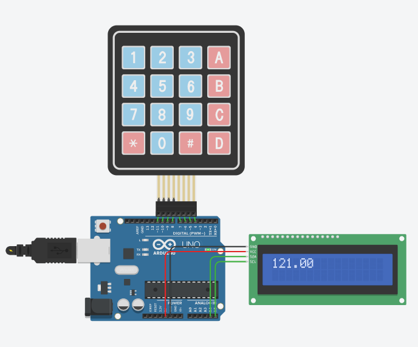
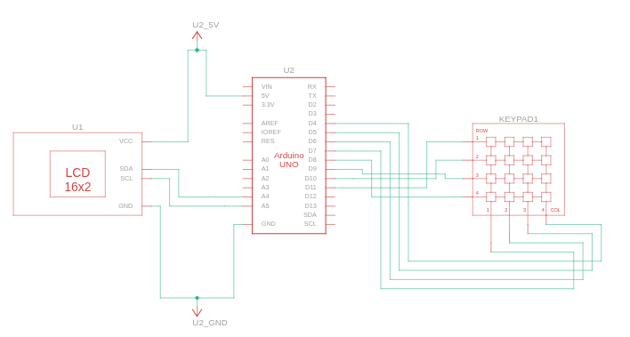

# 4x4 Basic Keypad Calculator

A simple calculator using Arduino, a 4x4 keypad, and a 16x2 LCD display. Perform basic arithmetic operations (+, -, *, /) with real-time feedback on the LCD.

## Demo

## Circuit Schema

## Features

- Addition, subtraction, multiplication, and division
- Error handling for division by zero
- Reset functionality

## Usage

1. Connect the hardware as shown in the schema.
2. Upload the code to your Arduino.
3. Use the keypad to enter numbers and select operations:
   - `A` = `+`
   - `B` = `-`
   - `C` = `*`
   - `D` = `/`
   - `*` = Reset
   - `#` = Calculate/Equals
  
## Contribution
Feel free to contribute.

## License

This project is released into the public domain. See [LICENSE](LICENSE) for details.
